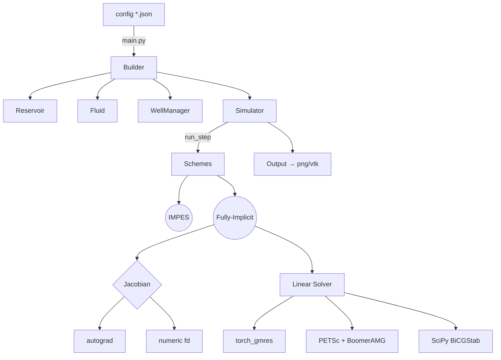

# Архитектура и карта модулей `oil-simulator-py`

> Актуально для ветки `fully-implicit-new`, июнь 2025

---

## 1. Общая схема



* **Builder** — подготовка объектов по конфигу, в т. ч. выбор устройства и бэкенда линейного решателя.
* **Simulator** — единая точка входа, содержит реализацию обоих численных схем и всю вспомогательную логику.

---

## 2. Дерево каталогов (важные узлы)

| Путь | Содержимое |
|------|------------|
| `src/simulator/` | Главные доменные классы (`reservoir.py`, `fluid.py`, `well.py`, `simulation.py`, `mg.py`) |
| `src/linear_gpu/` | GPU-ориентированные решения ЛАУ (AMGX, torch-GMRES, PETSc-CUDA обёртки) |
| `src/output/` | `vtk_writer.py` — экспорт результатов |
| `src/plotting/` | Пост-процессор карт давления/насыщенности |
| `src/rl_env.py` | Gym-обёртка среды для RL |

---

## 3. Численные схемы

### 3.1 IMPES
* Давление — линейная система `A·P = b` (7-точечный шаблон), решается CG (`torch_cg`) с диагональным предобуславливателем.
* Насыщенность — явный апстриминг + CFL-контроль.

### 3.2 Fully-Implicit
1. Predictor: однократный шаг IMPES для инициализации.
2. Решатель Ньютона (варианты):
   * autograd-Jacobian + GMRES
   * JFNK (fd-Jacobian-free) с Krylov-подпространством
3. Предобуславливатель CPR:
   * давление-блок → AMG (BoomerAMG через PETSc)
   * насыщенности → ω-Jacobi (`ω = 0.8`)
4. Trust-region + line-search (Armijo) для устойчивости.

---

## 4. Линейные решатели и бэкенды

| Backend | Файл | Где включается |
|---------|------|----------------|
| `torch_gmres` | `src/linear_gpu/gmres.py` | fallback при отсутствии PETSc или по конфигу |
| `hypre` | `src/linear_gpu/petsc_boomeramg.py` | auto-detect через `petsc4py`; используется в CPR |
| `scipy_bicgstab` | `simulation._bicgstab` | мелкие сетки / отладка |

Автовыбор описан в `Simulator.__init__`: попытка импортировать `petsc4py`, иначе включается `torch_gmres`.

---

## 5. Классы и ключевые методы

| Файл | Класс / Функция | Назначение |
|------|-----------------|------------|
| `reservoir.py` | `Reservoir` | Геометрия сетки, пористость, проницаемости |
| `fluid.py` | `Fluid` | PVT, кривые относит. прониц., ρ(P), μ |
| `well.py` | `Well`, `WellManager` | Скважины: дебит/давление, индексы ячеек |
| `simulation.py` | `Simulator` | Главный цикл, IMPES и Fully-Implicit схемы |
| | `_fi_jfnk_step` | JFNK-решатель с CPR |
| | `_assemble_pressure_csr` | Генерация N×N CSR для AMG |
| `linear_gpu/gmres.py` | `torch_gmres` | GPU-устойчивый GMRES |
| `linear_gpu/petsc_boomeramg.py` | `solve_boomeramg` | Обёртка Hypre/BoomerAMG через PETSc |

Полный список функций можно сгенерировать через `pydoc` или `sphinx-apidoc`.

---

## 6. Конфигурация

Конфиг JSON содержит блоки:
* `solver_type`: `impes` | `fully_implicit`
* `linear_solver`: `backend`, `tol`, `max_iter`, `restart`
* `time_step_days`, `max_time_step_attempts`, `dt_reduction_factor`
* `device`: `cpu` | `cuda:0` | `cuda:1` | `ddp`
* физпараметры пласта (`reservoir`), флюида (`fluid`), скважин (`wells`)

---

## 7. Генерация API-документации

1. Установить dev-зависимости:
   ```bash
   pip install sphinx sphinx_rtd_theme myst_parser
   ```
2. Сгенерировать шаблон:
   ```bash
   sphinx-quickstart docs  --sep -q -p "oil-simulator" -a "Team" -l ru
   sphinx-apidoc -o docs/source src
   ```
3. В `conf.py` включить `extensions = [ 'myst_parser', 'sphinx.ext.autodoc', 'sphinx.ext.napoleon' ]`.
4. Собрать HTML:
   ```bash
   make -C docs html
   open docs/_build/html/index.html
   ```

---

## 8. Как расширять

* Добавить новый предобуславливатель → создать модуль в `src/solver/`, зарегистрировать в `Simulator`.
* Третья фаза (газ) — уже поддержана: переменная `Sg`, rel‑perm `krg`, газовые `ρ_g(P)`, `μ_g(P)`, опционально `Rs/Rv`. Включение через `sim_params.three_phase=true` и наличие поля `fluid.s_g`. См. реализацию в `simulation.py` (вектора состояния `[P, Sw, Sg]`, сборка невязки и клампы) и тесты `tests/test_three_phase_*`.
* Трубопроводная сеть → реализовать 1D-элементы и соединить через граничные условия в `well.py`.

---

### Контакты и контрибьюции
PR-ы приветствуются! Используйте Issues для вопросов по коду и алгоритмам. 