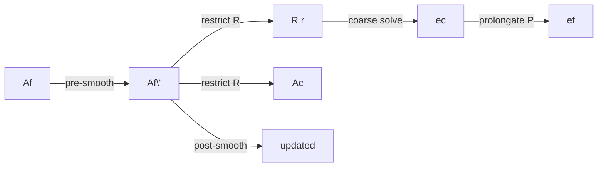

## Математика и численные методы

Ниже — полная формулировка уравнений, дискретизация, JFNK/CPR/AMG, критерии сходимости и балансы. Все обозначения согласованы с кодом (`simulation.py`, `cpr.py`, `geo_solver_v2.py`, `jfnk.py`).

### 1) Уравнения и физика

Множество фаз f ∈ {w, o, (g)}. Для каждой фазы на контрольном объёме V_i:

$$
\frac{\partial}{\partial t}\big(\phi(P_i)\, \rho_f(P_i)\, S_{f,i}\big)\; + \; \sum\limits_{j\in N(i)} F_{f,ij} \;=\; q_{f,i}
$$

где:
- $\phi$ — пористость (возможна зависимость от давления: $\phi(P)=\phi_0\, (1+c_r (P-p_{ref}))$).
- $\rho_f(P)$ — плотность фазы. Без PVT — заданные функции от $P$; с PVT — через объёмные коэффициенты $B_f$ и растворённые газ/нефть $R_s, R_v$.
- $S_f$ — насыщенность, $\sum_f S_f = 1$, $S_f\in[0,1]$.
- $F_{f,ij}$ — фазовый поток через грань i↔j (см. ниже TPFA).
- $q_{f,i}$ — источник/сток (скважина, граничный поток).

Darcy‑поток фазы (TPFA, upwind по $\lambda_f$):

$$
F_{f,ij} = T_{ij}\, \lambda_{f,upw}\, \big( (P_i-\rho_{f,upw} g z_i) - (P_j-\rho_{f,upw} g z_j) \big)
$$

где $\lambda_f = k_{r,f}/\mu_f$ — подвижность, $T_{ij}$ — трансмиссивность грани (геометрия и проницаемости), upwind выбирается по знаку суммарного пьезометрического перепада.

Суммарная подвижность и фракции: $\lambda_t = \sum_f \lambda_f$, $f_f = \lambda_f/\lambda_t$.

Переход к переменной насыщенности воды через ограничивающее преобразование $ y = \sigma(S_w) $ (сигмоида), инверсия $S_w=\sigma^{-1}(y)$. Производная $dS/dy$ используется в диагонали S‑блока CPR и при линейном поиске.

Капиллярное давление и капиллярные силы, если включены, входят в поток через доп. член $\nabla p_c(S)$ (в текущих конфигурациях — опционально, см. `props.py`).

### 2) Дискретизация (TPFA + Backward Euler)

- Пространство: TPFA. Для осреднения проницаемости по грани используем гармоническую среднюю: $T_{ij} = A_{ij} / (d_i/k_i + d_j/k_j)$, где $A_{ij}$ — площадь грани, $d_i$, $d_j$ — расстояния до центров.
- Время: полностью неявная схема (Backward Euler) с шагом $\Delta t$:

$$
\frac{1}{\Delta t}\, \Big( m_f^{n+1} - m_f^{n} \Big) + \sum_{j\in N(i)} F_{f,ij}^{n+1} = q_{f,i}^{n+1}
$$

$ m_f = \phi(P)\, \rho_f(P)\, S_f\, V_i $ — масса фазы в ячейке. Суммирование по фазам даёт «давленческую» составляющую (эллиптика) + «транспортную» (насыщенности).

Граничные условия: no‑flow по умолчанию; при наличии фиксированного давления/флюкса входят как $q$ или через ghost‑ячейки.

Скважины: формула Писмана для индекса WI и связь дебита/забойного давления. При управлении по BHP: $q_{tot} = WI\, \lambda_t\, (P_{cell}-P_{bhp})$, знак «отток из пласта» при $q_{tot}>0$. Массовый вклад: $\rho_{mix,flow} = \sum_f \rho_f f_f$.

### 3) Нелинейная система и скейлинг (hat‑переменные)

Собираем $F(x)=0$ для $x=[p, y, (s_g)]$. Для улучшения кондиционирования применяем масштабирование: $\hat x = D_x x$, $\hat F = D_F F$ (см. `normalizer.py`). Диагностически печатаются нормы в hat‑пространстве и физические изменения (Па, доли насыщенности).

### 4) JFNK: Якобиан‑свободный Ньютон + FGMRES

- Итерация: $J(x_k)\,\delta_k = -F(x_k)$, $x_{k+1}=x_k + \alpha_k\, \delta_k$.
- Действие Якобиана: $J\,v \approx [F(x+\epsilon v)-F(x)]/\epsilon$ с адаптивным $\epsilon = \sqrt{\varepsilon_{mach}}\, (1+\|x\|)/\|v\|$.
- Линейный решатель: FGMRES(restart, max_iter) с предобуславливателем M ≈ J^{-1} (реализован CPR).
- Форсинг Eisenstat–Walker: $\eta_k = c\,(\|F_k\|/\|F_{k-1}\|)^p$ с границами $[\eta_{min},\eta_{max}]$, задаёт tol GMRES на каждой итерации Ньютона.
- Line Search: Armijo $\|F(x+\alpha\delta)\|\le (1-c_1\alpha)\,\|F(x)\|$ с нижним порогом убывания; при необходимости backtracking и «probe» по сетке $\alpha$. Trust‑region ограничивает $\|\delta\|$.
- Физические ограничения шага: (i) предел по давлению в Па ($\Delta p_{\max}$); (ii) равномерное масштабирование компоненты $\delta_y$ так, чтобы $S_w\in[Swc,1-Sor]$.

### 5) CPR: двухступенчатое предобуславливание

Разделим переменные на давление $p$ и насыщенности $s$. Блочная структура Якобиана:

$$
J = \begin{pmatrix} A_{pp} & A_{ps} \\ A_{sp} & A_{ss} \end{pmatrix},\quad r=\begin{pmatrix} r_p \\ r_s \end{pmatrix}.
$$

Идея CPR — сначала приблизительно решить «давленческий» блок, затем скорректировать насыщенности:

1) Stage‑1 (Pressure): решаем $A_{pp}\, z_p \approx r_p$ с помощью Geo‑AMG (несколько V‑циклов). $A_{pp}$ собирается из TPFA‑оператора с суммарной подвижностью $\lambda_t$ (эллиптика).

2) Stage‑2 (Saturation smoother): корректируем $s$ с оператором, близким к транспорту. В диагональ помещаем физически значимый коэффициент

$$
D_s \approx \frac{\phi\,V\,\rho_w}{\Delta t}\, \frac{dS_w}{dy}
$$

вне диагонали — разрежённые связи (локальный «W»), 1–2 итерации Jacobi/GS. Используем защиты: $dS/dy\ge dS/dy_{min}$, клампы по насыщенности, `nan_to_num`.

В реализации все операции CPR выполняются в hat‑пространстве; физические величины используются только для лимитеров.

### 6) Geo‑AMG: иерархический решатель давления

- Коарсенинг 2×2×2 (агрегация), построение $P$ (prolongation, piecewise‑constant) и $R = D^{-1} P^T$ (усреднение по детям).
- RAP‑проекция: $A_c = R\, A_f\, P$ с аккумулированием дубликатов, санитацией NaN/Inf.
- Эквилибрирование строк: $A \leftarrow W\,A$, $W=\mathrm{diag}(1/\|row\|_1)$, улучшает кондиционирование.
- Сглаживатель: RBGS (red‑black Gauss–Seidel) 2–3 прохода на каждом уровне; возможен Chebyshev хвост.
- Проход V‑цикла: pre‑smooth → restrict → coarse solve (небольшой solve/несколько итераций) → prolongate → post‑smooth.

Ожидаемое снижение нормы за один V‑цикл (в логах `ρ_v`) ~ 0.18–0.20.

### 7) Критерии сходимости

- Ньютона: $\|F\|_2$ и/или масштабированная $\|F\|_{scaled}$ ниже порогов (ранний и финальный tol), ограничение числа итераций.
- GMRES: достигнут $\eta_k$ по Eisenstat–Walker, либо превышен лимит — выполняется повтор с ослабленным tol; если $\delta$ конечен, выполняем LS; если нет — честный fail.
- Line Search: принятие шага при Armijo или при «probe»‑минимуме с достаточным снижением.

### 8) Балансы

- Объёмный: $\Delta V_{pore\,mix} + V_{wells} \approx 0$. В текущей объёмной формулировке vol err≈0% на шаг.
- Массовый (кг): $\Delta M + M_{wells} \approx 0$. Без PVT — небольшая остаточная ошибка (десятки bps) по определению «масса vs объёмная дискретизация»; с PVT и конверсиями surface↔reservoir — строгий.

### 9) GPU/скейлинг

Вычисления реализованы на PyTorch (CUDA): сбор F, J·v (конечные разности), CPR/AMG (разреженные CSR/COO тензоры). RAP и эквилибрирование реализованы в разреженном формате.

### 10) Ссылки

- Saad, Y. Iterative Methods for Sparse Linear Systems — GMRES/FGMRES.
- Wallis, R. Jacobian‑Free Newton–Krylov methods for nonlinear flow.
- Wallis, Young, et al. Constrained Pressure Residual preconditioning.
- Trottenberg, Oosterlee, Schüller. Multigrid.

