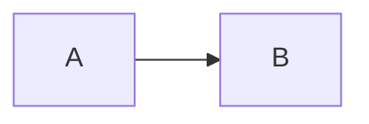

# Добро пожаловать

Эта документация собирается MkDocs Material и поддерживает MathJax и Mermaid. Формулы используйте как `$a^2+b^2=c^2$` (inline) и `$$A x = b$$` (block). Диаграммы оформляйте как:

Перейдите по разделам в меню слева.

